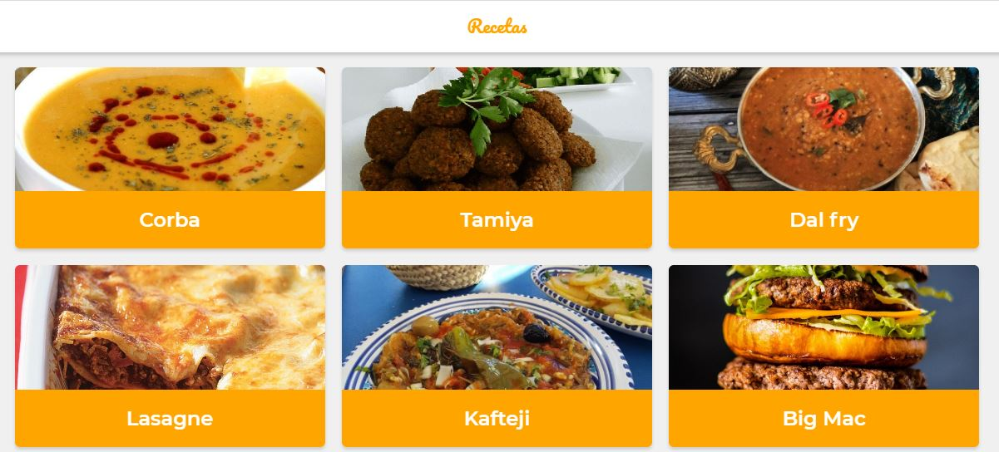

# Curso de PWA con React en Platzi

Este repositorio contiene todo el contenido del curso a medida que construimos una app para ver recetas con la API de MealDB.

Hay un branch por clase para que puedas navegar con facilidad el curso.

## Scripts

- `npm install` para instalar las dependencias
- `npm run dev` para entorno de desarrollo
- `npm run build && npm start` para producción

## Licencia

MIT
